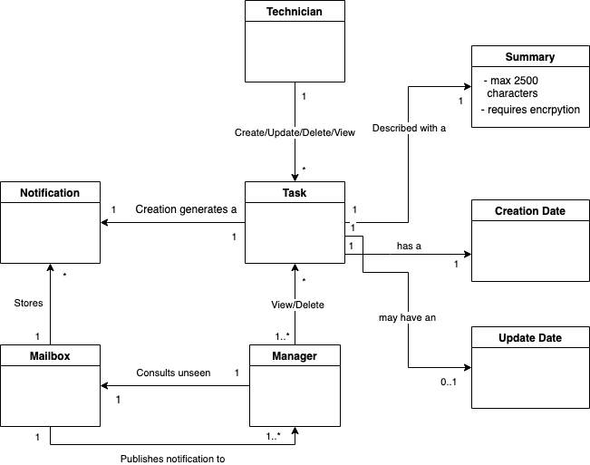
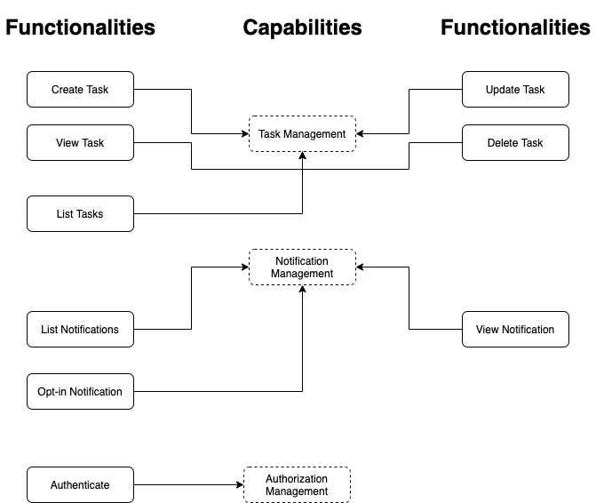
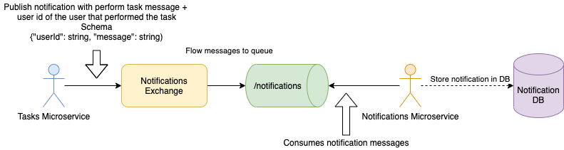
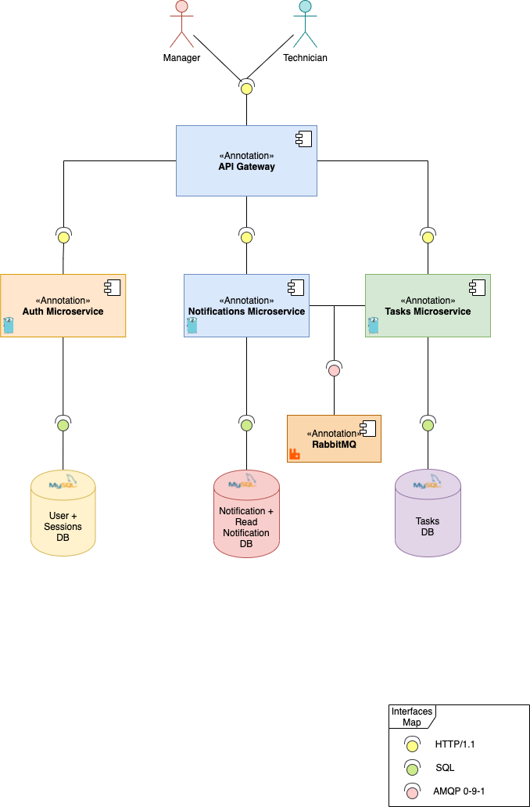

# sword-health-technical-challenge

The present repository contains all source used to perform SWORD Health technical challenge. I've chosen `Golang` as the primary programming language for three reasons: its the job position intended language, its rapid for prototyping and prevents from nasty bugs such as null pointers and exceptions. To produce a more valuable, production result, it was decided to follow some strict conventions as documented in the section below. These conventions are both suggestions from the official Golang team and past members [2], [3], as well as the community in general [1].

## Challenge

The technical challenge involves producing a system capable of allowing users to manage tasks. These users are distinguished in two roles: `Manager` and `Technician`. The manager supervises in some form technicians, as his role allows him to view their tasks and delete them. Managers also receive notifications when a technician performs a task.

A task is composed of two key elements:

- Summary, supporting a max. of 2500 characters. Summaries can also contain personal information;
- Date, of when it was performed.

These elements raise some concerns: personal information and control management. Data privacy is an hot topic these days, as data protection laws are very strict. This requires the application of a strict encryption algorithm in the task summary. Also, tasks can be updated. Should a task have a creation and update date?

It is also mentioned that tasks are performed during working days. Should it be prevented that employees do not update their tasks during non-working days?

------

For features, it has been asked to:

- Create an API endpoint to save a new task (Create/Update/Delete);
- Create an API endpoint to list tasks;
- Notify manager of each task performed by the tech, without blocking any http request.

For technical requirements:

- Use any language to develop the system HTTP API;
- Use MySQL database to persist data from the application;
- Create a local development environment using docker containing the services and a MySQL database;
- Features should have unit tests to ensure they are working properly.

As a bonus, notification logic should be decoupled from the main application flow, using a message broker. Also, system deployment in Kubernetes is a plus.

## Design

Once analysed the challenge context, a preliminary design can be thought of. The product dwells on several domains:

- User, authentication and authorization management;
- Tasks;
- Permissions;
- Notifications;
- Security.

To make things easier, I suggest that users can be mocked in some form, as a complete signup/login process is not required by the challenge. To control API access, authentication keys will still be required, but these can be generated by passing the user id.

Permissions are decided based on the role of the user. If the user is a technician, he can: list and view his tasks, create a task, update and delete it. If the user is a manager, he can: list and view technician tasks, as well as deleting them. Also, as a bonus I'd suggest that updates on tasks are prohibited on non-working days (i.e., saturday, sunday), to comply with the challenge description.

Notifications are published under the hood when a task is performed, to be later seen by the managers. This raises a question: are notifications established in a many-to-many relationship? Do all managers receive at the same time a notification from a single update on the task by a technician? Maybe it would be better to allow to opt-in for specific updates on the task (all updates, only create, update or delete) or for a specific technician. Also, what happens when managers are not online and a task is updated? If they want to see the notifications, these need to be stored on a separate queue/mail box, that can be later accessed remotely by the manager.

Security is present not only on the autorization layer, but also on tasks and notifications. Task summary may contain personal identification, so it is required to be applied encryption.

To better visualize these domain concepts, the following domain diagram is proposed:



<center><i>Figure 1 - Domain Diagram illustrating the domain concepts relationships, with UML (Tool: draw.io)</i></center>

Laid down the domain concepts, more architecture decision can be made. The monolith vs micro-service decision can be settle down based on what is known so far. Following a monolith approach would be a quick way to build and ship the system, but it suffers from several issues such as:

- Domain scaling: if more and more concepts are introduced, the system becomes a giant ball-of-mud;
- Too much responsibilities: Having all the code and runtime for the users, authentication, authorization, tasks, permissions and notifications on a single system is hard to both develop and maintain;
- Cross-cutting concerns: performance, single point of failure, etc.

Having a giant system is not acceptable, so there is the need to cut it down in pieces. To follow a micro-service approach, it is needed to apply a strategy to divide the system in smaller services. There are already plenty famous patterns that are adopted and adapted by engineers to achieve this (e.g., business capabilities, bounded-contexts, etc), so no need to reinvent the wheel on this one.

Bounded-Contexts is a design pattern from DDD (Domain Driven Design), and intends to segregate the monolith domain in different smaller domains (i.e., sub-domain). Typically, these smaller domains are identified by aggregate roots and ultimately there is an identification of a microservice per aggregate root (similar to database per service). This segregation is convenient to apply when the domain is quite big and there is time to perform such seperation. Unfortunately, these conditions do not met for this challenge, so applying the bounded-context pattern is rejected. Division by business capabilities on the other hand is rather simpler, not requiring so much time. There are different ways to identify such capabilities, such as through system functionalities/use cases.

The diagram below represents the challenge functionalities connected to each capability:



<center><i>Figure 2 - Diagram illustrating the business capabilities decomposed by the product functionalities (Tool: draw.io)</i></center>

As seen in the diagram, a total of three business capabilities have been identified: tasks, notifications and authorization management. Each of these capabilities identify a microservice.

Having each microservice identified, it is now possible to apply more design decision in order to strength the system. Typically, microservices each have their own databases, to avoid single point of failures in the data layer (Database per Service). CQRS (Command-Query Responsibility Segregation) could also be applied to reduce latency in the read/write operations, but that's a little bit overkill given the system dimension, as well as the time to develop. API Gateway is a bonus for a more production-ready system, as it serves as a firewall, threshold and load-balancer for the microservices.

Now, before starting development, the only thing missing is designing each of the microservices APIs schemas and decide how deployment occur.

In the tasks services, thinking as a RESTless API, there is the `tasks` collection, allowing for:

- Retrieving all tasks (`GET /tasks`);
- Create a task (`POST /tasks`);
- View a task (`GET /tasks/:id`);
- Update a task (`PUT /tasks/:id`);
- And delete a task (`DELETE /tasks/:id`).

Heading over to the notifications service, there are two APIs:

- Public API for retrieving and viewing non-read notifications, as well as to opt-in for specific notifications (`/notifications` collection);
- Private API for publishing and consuming a task perform event.

Finally, in the authorization service:

- Authenticate (`POST /authenticate`).

Regarding microservices RESTless APIs, documentation about them can be found [here](auth/api/swagger.yml), [here](notifications/api/swagger.yml) and [here](tasks/api/swagger.yml), respectively for auth, notifications and tasks services. They have specified using the `OpenAPI 3.0.1` specification, and can be viewed using an Open API interpreter (e.g., [editor.swagger.io](https://editor.swagger.io/)). HTTP Clients ready to interact with the APIs can also be generated from these files.

Regarding notifications messaging API, AMQP is being to command the publish of these in the tasks service and their consumption in the notification service. Diagram bellow provides a summary of it.



<center><i>Figure 3 - Diagram illustrating the flow of notification messages between tasks and notifications microservices (Tool: draw.io)</i></center>

After receiving the notification message, notifications service stores it on a database, so that it can later be read by the managers. Once the notification has been read, a record in the database is stored indicating that the manager read the notificatiom, removing it from his mailbox.

-----



<center><i>Figure 4 - Diagram illustrating solution components, their interfaces and communication (Tool: draw.io)</i></center>

Figure 4 describes on a coarse view the interactions between the components of the system: the microservices, their databases, the API gateway, the RabbitMQ server and the manager & technician. Each of these components are deployed with Docker and scaled with Kubernetes.

-----

For developing the system, I've selected the following libraries and tools:

- [Echo](https://github.com/labstack/echo) (v4) as the web framework (serves its purpose, easy to use and had prior experience with it);
- [gorm](https://github.com/go-gorm/gorm) as the "ORM" (also prior experience with);
- [golang-jwt/jwt](https://github.com/golang-jwt/jwt) for JWT token signing;
- [streadway/amqp](https://github.com/streadway/amqp) for AMQP connection;
- [crypto/cipher](https://pkg.go.dev/crypto/cipher) for tasks summary encryption with AES-256;
- RabbitMQ as the commander of the notification messages mailbox;
- MySQL as the database instance for storing information;
- Swagger Editor for developing RESTless APIs documentation;
- Golang version: `1.16`.

## Outcomes

todo: create table explaining why certain things were not done and reflections in pain points and things to improve

Major pain points, less proficient, etc...
Things to improve
Encryption a little bit ugly
External vs Internal identifiers
Duplicated Code
Tests, mocking
Authorization tokens can be cracked
Environment variables

## Testing

Get Tasks

```
curl -XGET -H 'X-User-ID: x' -H 'X-User-Role: 0' -H "Content-type: application/json" 'http://localhost/tasks?index=0' -i
```

Create Task

```
curl -XPOST -H 'X-User-ID: x' -H 'X-User-Role: 0' -H "Content-type: application/json" -d '{"summary":"abc"}' 'http://localhost/tasks' -i
```

Get Task

```
curl -XGET -H 'X-User-ID: x' -H 'X-User-Role: 0' -H "Content-type: application/json" 'http://localhost/tasks/:id' -i
```

Update Task

```
curl -XPUT -H 'X-User-ID: x' -H 'X-User-Role: 0' -H "Content-type: application/json" -d '{"summary":"abc"}' 'http://localhost/tasks/:id' -i
```

Delete Task

```
curl -XDELETE -H 'X-User-ID: x' -H 'X-User-Role: 0' -H "Content-type: application/json" 'http://localhost/tasks/:id' -i
```

Get Notifications

```
curl -XGET -H 'X-User-ID: x' -H 'X-User-Role: 1' -H "Content-type: application/json" 'http://localhost:81/notifications' -i
```

Read Notification

```
curl -XDELETE -H 'X-User-ID: x' -H 'X-User-Role: 1' -H "Content-type: application/json" 'http://localhost:81/notifications/:id' -i
```

Authenticate

```
curl -XPOST -H  -H -H "Content-type: application/json" -d '{"id":"tech","secret":"sword"}' 'http://localhost:82/authenticate' -i
```

## Development

First download module dependencies

```
go mod download
```

Then, load development environment variables

```
source scripts/load_dev_env.sh
```

Last, run the program main

```
go run cmd/<service_name>/main.go
```

These steps apply for all microservices and must be performed inside of each service directory

To run migrations

```
go run cmd/migrations/main.go
```

On auth microservice, make sure fake data is inserted to database

```
go run cmd/gen/main.go
```

## Deployment

Build Auth Service Container

```
docker build --tag sword-auth auth -f auth/deployments/Dockerfile
```

Build Notifications Service Container

```
docker build --tag sword-notifications notifications -f notifications/deployments/Dockerfile
```

Build Tasks Service Container

```
docker build --tag sword-tasks tasks -f tasks/deployments/Dockerfile
```

--------

Run Auth Service Container

```
docker run --env-file auth/deployments/prod.env sword-auth
```

Run Notifications Service Container

```
docker run --env-file notifications/deployments/prod.env sword-notifications
```

Run Tasks Service Container

```
docker run --env-file tasks/deployments/prod.env sword-tasks
```

Run MySQL Composer

```
docker-compose -f tools/mysql/docker-compose.yml up
```

Run RabbitMQ Composer

```
docker-compose -f tools/rabbitmq/docker-compose.yml up
```

## Conventions

For naming [2]:

- Keep it short, keep it simple: Reduce common variables to one,two or three letters (e.g., i - index, k - key, ip - ip address, ctx - context);
- Leave **err** for errors;
- Use **camelCase** for local variables, parameters (e.g., sortedList);
- Use **CAPITALCASE** for acronyms (e.g., HTTP, ID);
- Use **PascalCase** for functions, types, interfaces (e.g., PrimeSearch);
- Use **lowercase** only for package names and try to short for one noun (e.g., user, auth);
- Use Error as a **suffix** when defining error types (e.g., UsernameError);
- Use Err as a **prefix** when declaring error variables (e.g., ErrUsername);
- Don't use **snake_case**.

For packages [2], [3]:

- Organize by responsibility, not collection: Avoid models, utils, etc;
- Separate files by responsibility (e.g., http.go, headers.go, cookies.go);
- Top-level package documentation should be written in the `doc.go` file.
- `/cmd/` directory describes the main executable code for the Go progam;
- `/internal/` directory describes internal, non-shared code (i.e., private application code);
- `/pkg/` directory describes shared code externally that other applications can use;
- `/configs/` directory describes configuration files templates;
- `/deployments/` directory describes deployment configuration files;
- `/scripts/` directory describes internal scripts used to automate the application (e.g., build, test, analyse);
- `/third_party/` directory describes external helper tools binaries, files and forked code;
- Directories following /cmd/ should match the name of the executable;
- Directories inside /internal/ can be named as /pkg and /app to separate application and libraries code.

### Sources:

[1] [Community Standard Project Layout for Golang - 2021](https://github.com/golang-standards/project-layout)

[2] [Naming Conventions Proposed By Andrew Gerrand (Google) - 2014](https://talks.golang.org/2014/names.slide)

[3] [Package Conventions Proposed By Rakyll (Google) - 2017](https://rakyll.org/style-packages/)